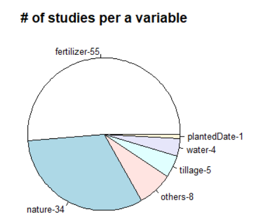
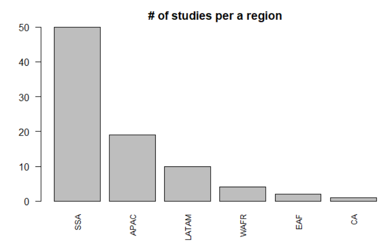
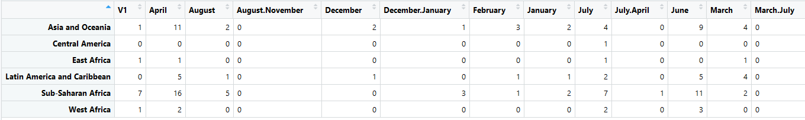
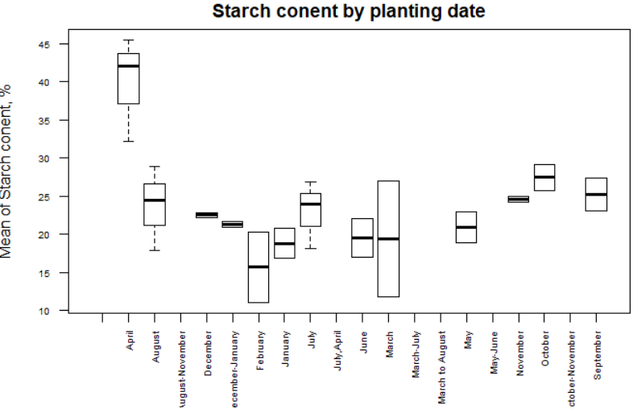

## Problem statement
One of the CIALCA's partners, a producer of a large-scale cassava processing producing cassava starch for export wants to improve production techniques to increase starch content of roots supplied to the factory.

## Research questions
Based on the existing studies, identify (1) whether changing planting dates can improve starch content.
(2) an optimal sample size in order to measure the fetrilizer impact on the starch content.

### Research question # 1. Analysis of whether changes in planting dates can improve starch content
The below analysis is based on the assumption that a harvesting season depends on varietal characteristics, site/region and care with the site/region being the primary factor.

```{r, echo = FALSE}
literatureReview <- read.csv("files/literatureReview.csv")
#Assigning IDs to every study to group them afterwards as the STUDYID col is not an unique identifier
LR <- transform(literatureReview,id=as.numeric(factor(title)))
```

The analysis showed that each study reviews impact of only one key variable such as variety ('nature') or an agronomic variable ('nurture') such as fertilizer composition, water regime, planting techniques and harvest dates on yield. As such, all articles were categorized based on the variable (see above) reviewed.

```{r, echo = FALSE}
#Grouping the studies previously segmented either nature or nutrite based on subjective evaluation i.e. all studies that have the keyword 'overcrop' were assigned to the category 'nature'
nurture <- c(1,3,4,12,13,14,15,17,18,19,20,21,22,23,24,25,26,28,29,30,31,32,33,34,35,38,39,40,41,42,43,50,51,52,53,56,57,59,61,62,63,65,66,67,68,74,75,76,77,78,79,80,81,82,83,84,85,86,87,88,91,93,94,95,96,97,98,99,100,102,103,104,106)
#Removing duplicated entries
LRUnique <- unique(LR[c('id','title','region')])
LRUnique <- cbind(LRUnique, articleType=ifelse(LRUnique$id %in% nurture, "nurture", "nature"))
LRUnique <- cbind(LRUnique, articleTypeDetailed=ifelse(LRUnique$articleType=="nature","nature",ifelse(grepl('water|dry|hydraulic', ignore.case = TRUE, LRUnique$title), "water",                                                 ifelse(grepl('nutrition|potassium|fertilizer|fertilizing|fertilizers|nitrogen|mineral|fertilization|ash|potassium|land|nutrient|soil', ignore.case = TRUE, LRUnique$title),"fertilizer",
ifelse(grepl('tillage|tilled', ignore.case = TRUE, LRUnique$title),"tillage",
ifelse(grepl('date', ignore.case = TRUE, LRUnique$title),"plantedDate","others"))))))
str(LRUnique)
```

```{r, echo=FALSE}
#Creating a frequency table which shows the number of studies per a variable
LRFreq <- as.data.frame(table(LRUnique$articleTypeDetailed)) 
#Sorting values in a descending order
LROrdered <- LRFreq[order(-LRFreq$Freq),]
#Building a graph which shows the # of studies per a variable (see the list of variables above)
pie(LROrdered$Freq, 
    labels = paste(LROrdered$Var1,"-", LROrdered$Freq, sep=""), 
    main="# of studies per a variable",
    cex=0.8)    
```


The analysis illustrated that there is just one study in the database - 'Effect of date of planting and rainfall distribution on the yield of five cassava varieties in Lampung, Indonesia' by Fauzan I and	Puspitorini P - which investigates the impact of planting dates on yield. However as the study was done in Indonesia, the results cannot be applied, unless the CIALCA's partner is located in the Asia and Oceania region.

```{r, echo = TRIE}
#Extracting title of the article which has plantedDate
print(LRUnique[LRUnique[, "articleTypeDetailed"] == "plantedDate",])
```

Based on the title as well abstracts, the regions for the majority of the articles were identified where SSA is the abbreviation  for Sub-Saharan Africa; APAC, for the Asia-Pacific region; LATAM, for Latin America; WAFR, for West Africa; EAF, for Eastern Africa; and CA, for Central America.

```{r, echo=FALSE}
#Creating a frequency table which shows the number of studies conducted per a region
LRFreqReg <- as.data.frame(table(LRUnique$region)) 
#Sorting values in a descending order
LROrderedReg <- LRFreqReg[order(-LRFreqReg$Freq),]
#Buidling a graph which shows the # of studies per a region
barplot(LROrderedReg$Freq, main="# of studies per a region", 
        las=2, cex.names=0.8,
        names.arg = c("SSA", "APAC" , "LATAM", "WAFR", 
                      "EAF","CA"))
```


As the analysis is based on the hypothesis that a site/region is the primary factor in the yield variability, the cross-tab which shows the # of studies by a region and planting season was built. 

The task doesn't say explicitly what region the partner belongs to, but assuming that the partner is from West Africa, the planting periods which were reviewed in the studies were April, May, June, July, September, October, and November (see the table extract below). 

```{r, echo = FALSE}
#Plotting planting seasons for every region
LRUniqueObservations <- unique(LR[c('id','region','monthPlanted')])
attach(LRUniqueObservations)
temperatureRegion <- data.frame(unclass(table(LRUniqueObservations$region,LRUniqueObservations$monthPlanted)))
temperatureRegion
```



If we decide to dig further and check the mean of starch content per a planting month, we will find out that after the data pre-processing i.e. removing all NAs in the Region and percStarch1 columns, there are just 566 observations out of 4402 originally available. Moreover, only studies done in Asia and Oceania, Latin America and Caribbean, Sub-Saharan Africa have the information on the starch content. Which, again, providing that the partner is located in West Africa makes it difficult to apply the results.

```{r, echo=FALSE}
#Removing NAs to calculate average.
stratchRemovedNa <- LR[!is.na(LR$percStarch1), ]
stratchRemovedNa <- stratchRemovedNa[!is.na(stratchRemovedNa$region), ]
library(plyr)
#Calculating the mean of starch content by planting date
meanRegion <- ddply(stratchRemovedNa, .(region,monthPlanted), colwise(mean, .(percStarch1)))
#Building the actual graph
plot(percStarch1 ~ monthPlanted,
     las=2, 
     cex.axis=0.6,     
     ylab = "Mean of Starch conent, %",
     xlab= "",
     main = "Starch conent by planting date",
     data = meanRegion)
```


### Research question # 2. An optimal sample size in order to measure the fetrilizer impact on starch content
As has previously alluded, lack of information on the partner makes it difficult to make any recommendations in regards to a sampling method. For example, depending on whether the partner grows large-scale cassava or just buys a shrub from farmers, one could use a random stratified sample of farms, cassava suppliers in case of the latter or random sampling, in case of the former. The literature review shows that usually, researchers take 3kg and 5kg sample size to observe the impact of fertilizers on yield. 

## Analysis limitation and further work
(i) The analysis is based on the assumption that the attached list of studies is all-encompassing. 
(ii) Papers were not assessed for quality.
(iii) Included papers were grouped subjectively - nature or nurture - and further subdivided by agronomic variablev which might have led to an error.

The above limitations could be mitigated through the following actions:
(1) Getting a data dictionary;
(2) Adjusting the study, knowing more about the partner;
(3) Thoroughly reviewing the papers from the database, not only abstract and conduct meta-analyses when possible to assess heterogeneity of studies and whether to combine their results.
